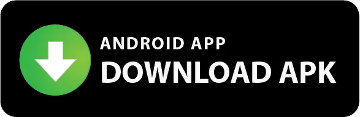

<h1 align="center">
   Observatory
</h1>

<p align="center">
    
</p>

Observatory is the essential app for tracking PC game prices and discounts exclusively from legitimate resellers. Easily monitor the best deals for your favorite PC games, ensuring you never miss out on a sale.

[](https://apps.apple.com/us/app/observatory-for-itad/id6479194330)
[](https://github.com/benjamindean/observatory/releases/latest)

## Screenshots

<p align="middle">
  
  
  
  
</p>

## Features

- Track discounts from 30+ legitimate resellers.
- Add games to your waitlist.
- Get notifications when your waitlisted games go on sale.
- Import your wishlist from Steam.
- Search games.
- View store-specific coupons if available.
- Select from 30+ color schemes to customize the app's appearance.

## FAQ

**Q:** Why does the discount in the app not match the discount at the store?  
**A:** It probably means that the data about prices is not updated on [IsThereAnyDeal.com](https://isthereanydeal.com) yet. The data is aggregated in multiple currencies from a lot of stores, so some delays are to be expected. This also applies to coupons, bundles, and review scores.

**Q:** The app is taking a long time to load and/or crashes. Do I have to submit a bug report?  
**A:** Sometimes there is a high load on the servers due to some major sales. There also might be maintenance going on. You can always check [IsThereAnyDeal.com](https://isthereanydeal.com) and if it's working as expected, please report a bug here.

**Q:** Will these keys get my Steam account blocked?  
**A:** No, all the stores within the app are legitimate key resellers, so there should be no "grey" keys whatsoever.

**Q:** I enabled notifications, but I'm not receiving them. What's wrong?
**A:** Observatory doesn't use push notifications; it utilizes local notifications. For notifications to function, the app needs to be in a suspended state. If it's terminated (removed from your recent app list), background operations cease. If you want to manually check for recently discounted games, select the **Discount Date** filter on the Waitlist page.

## Contributing

1. Register an app on IsThereAnyDeal [here](https://isthereanydeal.com/apps/my/) and mark it as unlisted.
2. Get your credentials and create a file `secrets.env` with the following content:

```env
OBSERVATORY_API_KEY= ...
```

Please request an API key by creating an Issue on GitHub.

3. Follow [Flutter Docs](https://docs.flutter.dev/) to set up the environment and run the app on an emulator or physical device.
4. Create a Pull Request describing your changes.

## Disclaimer 

All the data about prices, stores, coupons, review scores and discounts comes from [IsThereAnyDeal.com](https://isthereanydeal.com). Observatory is not affiliated with [IsThereAnyDeal.com](https://isthereanydeal.com) in any way.

## Support the Development

This app is free and ad-free, and I intend to keep it that way for the foreseeable future. If you enjoy the app, please consider supporting it. Any amount is appreciated.

**Please note that there are no additional features or benefits for supporters.**

[](https://www.buymeacoffee.com/benjaminabel)
